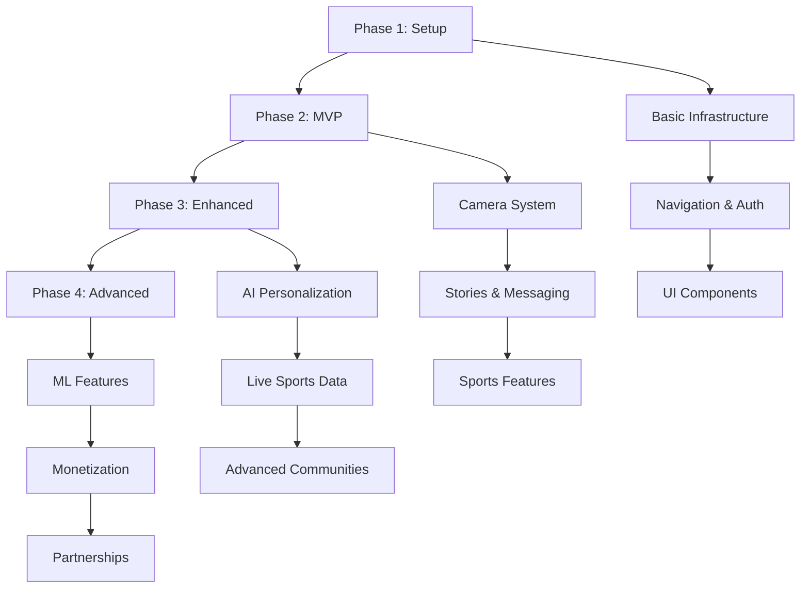

# Development Phases Overview

This directory contains the iterative development plan for building the AI-powered sports Snapchat application. Each phase builds upon the previous one, delivering increasingly sophisticated functionality while maintaining a working product throughout development.

## Phase Structure

### Phase 1: Setup - Foundation Framework ✅ COMPLETED
**Duration**: 1-2 weeks  
**Status**: ✅ COMPLETE (December 2024)  
**Goal**: Basic technical infrastructure and navigation

**Key Deliverables**:
- Project initialization with TypeScript and React Native
- Basic navigation and UI component library
- Authentication infrastructure 
- Core database schema
- Development environment setup

**End State**: Functional app with basic screens and authentication, but limited core features.

---

### Phase 2: MVP - Core Sports Snapchat Features  
**Duration**: 3-4 weeks  
**Status**: Minimal Viable Product  
**Goal**: Essential Snapchat functionality with sports integration

**Key Deliverables**:
- Camera and content creation system
- Stories with 24-hour expiration
- Real-time messaging and group chats
- Sports onboarding and user preferences
- Basic social graph and friend system
- Content feed and discovery

**End State**: Fully functional sports social app where users can capture content, share stories, message friends, and connect based on sports interests.

---

### Phase 3: Enhanced - AI Personalization & Live Sports Integration
**Duration**: 4-5 weeks  
**Status**: Enhanced Product  
**Goal**: AI-driven personalization with live sports data

**Key Deliverables**:
- RAG-powered content personalization
- Live sports data integration (scores, updates)
- Enhanced community features and moderation
- Advanced 2D overlays with native camera
- Intelligent notifications and engagement
- Sports content discovery and trending

**End State**: Intelligent sports companion that provides personalized content, live game updates, and sophisticated community features.

---

### Phase 4: Advanced - Professional Platform & Monetization
**Duration**: 6-8 weeks  
**Status**: Professional Platform  
**Goal**: Industry-leading sports social platform with monetization

**Key Deliverables**:
- Advanced AI and machine learning features
- Creator economy and monetization systems
- Professional sports partnerships
- Enterprise analytics and insights
- Global expansion and localization
- Advanced community governance

**End State**: Comprehensive professional platform competing with major sports media companies, featuring creator monetization and industry partnerships.

## Development Progression

## Technology Evolution

| Phase | Frontend | Backend | AI/ML | Camera |
|-------|----------|---------|-------|---------|
| 1 | Expo + NativeWind v4 | Supabase Basic | None | None |
| 2 | React Navigation | Real-time Features | Basic Sports Data | Expo Camera |
| 3 | Enhanced UI | Vector DB + Edge Functions | OpenAI GPT-4 + RAG | Native Camera |
| 4 | Global Localization | Enterprise Analytics | Advanced ML Models | Professional Overlays |

## Success Metrics by Phase

### Phase 1 Success Criteria ✅ ACHIEVED
- [x] App builds and runs on Android
- [x] Basic navigation works
- [x] User authentication complete
- [x] Database connection established

### Phase 2 Success Criteria  
- [ ] Users can capture and share content
- [ ] Real-time messaging functional
- [ ] Stories expire correctly
- [ ] Sports preferences collected
- [ ] Friend connections established

### Phase 3 Success Criteria
- [ ] AI content generation under 3 seconds
- [ ] Live sports data updates within 10 seconds
- [ ] Community engagement increases 200%
- [ ] Advanced 2D overlays functional
- [ ] Personalization accuracy above 85%

### Phase 4 Success Criteria
- [ ] Monthly recurring revenue reaches $100K+
- [ ] AI predictions achieve 70%+ accuracy
- [ ] International user base at 25%
- [ ] Creator retention above 80%
- [ ] Professional partnerships established

## Risk Management Across Phases

### Technical Risks
- **Phase 1**: Environment setup and dependency issues
- **Phase 2**: Real-time performance and storage costs
- **Phase 3**: AI API costs and sports data reliability
- **Phase 4**: Scalability and payment processing

### Business Risks
- **Phase 1**: Team coordination and timeline management
- **Phase 2**: User adoption and feature complexity
- **Phase 3**: Competition and user retention
- **Phase 4**: Monetization and regulatory compliance

## Phase Dependencies

### Hard Dependencies (Blocking)
- Phase 2 requires Phase 1 infrastructure
- Phase 3 requires Phase 2 user base for AI learning
- Phase 4 requires Phase 3 engagement metrics for monetization

### Soft Dependencies (Preferential)
- User feedback from each phase informs next phase priorities
- Performance metrics guide optimization efforts
- Market conditions may influence feature prioritization

## Resource Requirements

### Development Team
- **Phase 1**: 2-3 developers (Frontend + Backend)
- **Phase 2**: 3-4 developers (+ Mobile specialist)
- **Phase 3**: 4-5 developers (+ AI/ML engineer)
- **Phase 4**: 5-6 developers (+ Business development)

### External Dependencies
- **Phase 1**: Supabase setup and configuration
- **Phase 2**: ESPN API access and sports data
- **Phase 3**: OpenAI API credits and vector database
- **Phase 4**: Payment processing (Stripe) and partnership agreements

## Testing Strategy

### Phase 1 Testing
- Unit tests for core utilities
- Integration tests for authentication
- Basic UI component testing

### Phase 2 Testing
- Real-time messaging load testing
- Camera functionality across devices
- Story expiration verification

### Phase 3 Testing
- AI content quality assessment
- Sports data accuracy validation
- Community scalability testing

### Phase 4 Testing
- Payment processing security
- International localization
- Partnership integration testing

## Documentation Standards

Each phase includes:
- **Detailed feature specifications** with acceptance criteria
- **Technical implementation details** with code examples
- **Database schema updates** with migration scripts
- **Performance requirements** with measurable metrics
- **Success metrics** with clear validation criteria
- **Risk mitigation strategies** for identified challenges

## Getting Started

1. **Read the project foundation documents**:
   - `project-overview.md` - Overall project vision and goals
   - `tech-stack.md` - Technology choices and architecture
   - `project-rules.md` - Development standards and conventions

2. **Start with Phase 1**:
   - Follow the setup instructions in `phase-1-setup.md`
   - Complete all deliverables before proceeding to Phase 2

3. **Track progress**:
   - Use the success metrics to validate phase completion
   - Gather user feedback before advancing to next phase
   - Document lessons learned for future phases

4. **Iterate and improve**:
   - Each phase should result in a functional product
   - User feedback drives feature prioritization
   - Technical debt should be addressed before advancing phases 