# Development Phases Overview - RESTRUCTURED FOR SAFE IMPLEMENTATION

⚠️ **CRITICAL**: This restructured approach addresses key implementation risks and dependencies identified in the final review.

## 🚨 **Key Complications Identified & Mitigated**

### **Phase Dependencies** 
- **ISSUE**: Phase 3 RAG requires complete Phase 2 user data and social features
- **MITIGATION**: Mandatory Phase 2 completion checklist before Phase 3 begins
- **BLOCKING**: No Phase 3 start until user personalization and content systems are fully functional

### **Cost Control**
- **ISSUE**: Multiple paid APIs (OpenAI GPT-4o + 6 data sources) could escalate costs rapidly
- **MITIGATION**: Free-tier-first approach with hard spending limits and fallback mechanisms
- **MONITORING**: Daily cost tracking with automatic shutoffs at $50/day

### **Technical Complexity**
- **ISSUE**: LLM orchestration across 6 sources is highly complex for showcase
- **MITIGATION**: Phased rollout starting with 2 sources, expanding to 6 gradually
- **FALLBACK**: Simplified RAG implementation if multi-source proves too complex

### **Performance Requirements**
- **ISSUE**: 3-second response time with complex multi-source processing
- **MITIGATION**: Aggressive caching strategy and pre-generated content pools
- **MONITORING**: Real-time performance alerts and automatic fallbacks

---

## Phase Structure - REVISED FOR SAFETY

### Phase 1: Setup - Foundation Framework ✅ COMPLETED
**Duration**: 1-2 weeks  
**Status**: ✅ COMPLETE (December 2024)  
**Goal**: Basic technical infrastructure and navigation

**✅ VERIFIED COMPLETE**:
- Project initialization with TypeScript and React Native
- Basic navigation and UI component library
- Authentication infrastructure 
- Core database schema
- Development environment setup

---

### Phase 2: MVP - Core Sports Snapchat Features  
**Duration**: 3-4 weeks  
**Status**: ⚠️ **PARTIALLY COMPLETE** - **BLOCKING Phase 3**
**Goal**: Complete social app functionality before AI features

**🔴 PHASE 2 COMPLETION BLOCKERS** (Required before Phase 3):
- [ ] ❌ **Camera & Content Creation**: Not yet implemented
- [ ] ❌ **Stories System**: Critical for user content preferences
- [ ] ❌ **Discovery Feed Structure**: Required for RAG integration  
- [ ] ❌ **Friend System**: Needed for personalization data
- [ ] ❌ **Sports Onboarding**: Essential for user preferences
- [ ] ❌ **Content Interaction Tracking**: Required for AI learning

**✅ PHASE 2 COMPLETED**:
- [x] ✅ Authentication and user profiles
- [x] ✅ Communities feature with messaging
- [x] ✅ Basic navigation structure
- [x] ✅ Database schema foundation

**⚠️ CRITICAL DEPENDENCY**: Phase 3 RAG cannot begin until ALL Phase 2 features are functional and generating user interaction data.

---

### Phase 3: Enhanced - AI Personalization (RESTRUCTURED)
**Duration**: 6-8 weeks (EXTENDED for safety)  
**Status**: Ready for planning after Phase 2 completion
**Goal**: Gradual AI integration with cost controls

**RESTRUCTURED INTO 3 SUB-PHASES**:

#### **Phase 3A: Basic RAG Foundation** (Weeks 1-2)
**Goal**: Prove RAG concept with minimal complexity and cost
**Budget**: ~$25/month
**Risk**: LOW

#### **Scope**:
- **Multi-Source Foundation**: NewsAPI + BallDontLie + API-Sports (basic endpoints)
- **LLM**: GPT-4o-mini for cost efficiency ($0.150 per 1M input tokens)
- **Vector DB**: Supabase pgvector (free)
- **Content Types**: Text summaries only (no video/images)

#### **Phase 3B: Multi-Source Integration (Weeks 3-4)**  
- **Scope**: Add NewsAPI + BallDontLie (3 total sources)
- **LLM**: GPT-4o for quality (with cost limits)
- **Advanced Features**: Content deduplication
- **Goal**: Demonstrate multi-source fusion safely

#### **Phase 3C: Full Showcase Features (Weeks 5-6)**
- **Scope**: All 6 data sources if budget allows
- **Vector DB**: Optional Pinecone upgrade if needed
- **Advanced Features**: Real-time processing, live highlights
- **Goal**: Complete showcase experience

**🛡️ SAFETY MECHANISMS**:
- **Daily Cost Limits**: $30/day hard stop with alerts at $20
- **Fallback Strategy**: Pre-generated content if APIs fail
- **Performance Monitoring**: 5-second timeout with cached responses
- **User Feedback**: Mandatory feedback collection for AI quality

---

### Phase 4: Advanced - Professional Platform (UNCHANGED)
**Duration**: 6-8 weeks  
**Status**: Professional Platform  
**Goal**: Industry-leading sports social platform with monetization

---

## 🔄 **Revised Development Flow**

```mermaid
graph TD
    A[Phase 1: Setup ✅] --> B{Phase 2 Complete?}
    B -->|❌ NO| C[Complete ALL Phase 2 Features]
    C --> B
    B -->|✅ YES| D[Phase 3A: Basic RAG]
    D --> E{Cost/Performance OK?}
    E -->|❌ NO| F[Optimize/Simplify]
    F --> E
    E -->|✅ YES| G[Phase 3B: Multi-Source]
    G --> H{Budget/Quality OK?}
    H -->|❌ NO| I[Scale Back Features]
    H -->|✅ YES| J[Phase 3C: Full Showcase]
    J --> K[Phase 4: Professional]
```

## 🚨 **Phase 2 Completion Checklist** (BLOCKING)

Before Phase 3 can begin, ALL must be ✅:

### **Camera & Content Creation**
- [ ] Camera capture functionality working
- [ ] Basic 2D overlays implemented
- [ ] Content editing and preview system
- [ ] Media compression and storage

### **Stories & Discovery**
- [ ] 24-hour expiring stories system
- [ ] Discovery feed with tabbed navigation
- [ ] "For You" tab structure (required for RAG integration)
- [ ] Content interaction tracking (likes, views, shares)

### **Social Features**
- [ ] Friend system with requests/acceptance
- [ ] User search functionality
- [ ] Sports onboarding collecting preferences
- [ ] Real-time messaging beyond communities

### **Data Collection Systems**
- [ ] User personalization profiles collecting data
- [ ] Content interaction analytics
- [ ] Sports preference tracking
- [ ] Engagement metrics pipeline

**⚠️ HARD REQUIREMENT**: Phase 3 RAG requires actual user data to personalize content. Mock data is insufficient.

## 💰 **Cost Control Framework**

### **Phase 3A Budget** (Safe Start)
- **OpenAI**: $20/month (GPT-4o-mini)
- **APIs**: Free tiers only
- **Total**: ~$25/month

### **Phase 3B Budget** (Controlled Expansion)
- **OpenAI**: $40/month (GPT-4o upgrade)
- **APIs**: Limited paid usage
- **Total**: ~$60/month

### **Phase 3C Budget** (Full Showcase)
- **OpenAI**: $80/month (full GPT-4o usage)
- **Pinecone**: $70/month (if needed)
- **APIs**: Full paid tiers
- **Total**: ~$180/month MAX

**🔒 SAFETY NET**: Hard spending limits at each phase with automatic fallbacks to previous phase features.

## 📊 **Success Gates Between Phases**

### **Phase 2 → Phase 3A Gate**
- [ ] 50+ active users generating content daily
- [ ] Sports preferences collected for 80%+ users  
- [ ] Discovery feed functional with user interactions
- [ ] Stories system working with 24-hour expiration

### **Phase 3A → Phase 3B Gate**
- [ ] RAG responses under 5 seconds consistently
- [ ] User satisfaction >75% with AI content
- [ ] Cost per user per day under $0.10
- [ ] API reliability >95% uptime

### **Phase 3B → Phase 3C Gate**
- [ ] Multi-source deduplication working effectively
- [ ] User engagement with AI content +25%
- [ ] Budget under $60/month with current usage
- [ ] No critical performance issues

This restructured approach ensures each phase delivers value while managing risks and dependencies effectively.

## Development Progression

## Technology Evolution

| Phase | Frontend | Backend | AI/ML | Camera |
|-------|----------|---------|-------|---------|
| 1 | Expo + NativeWind v4 | Supabase Basic | None | None |
| 2 | React Navigation | Real-time Features | Basic Sports Data | Expo Camera |
| 3 | Enhanced UI | Vector DB + Edge Functions | OpenAI GPT-4 + RAG | Native Camera |
| 4 | Global Localization | Enterprise Analytics | Advanced ML Models | Professional Overlays |

## Success Metrics by Phase

### Phase 1 Success Criteria ✅ ACHIEVED
- [x] App builds and runs on Android
- [x] Basic navigation works
- [x] User authentication complete
- [x] Database connection established

### Phase 2 Success Criteria  
- [ ] Users can capture and share content
- [ ] Real-time messaging functional
- [ ] Stories expire correctly
- [ ] Sports preferences collected
- [ ] Friend connections established

### Phase 3 Success Criteria
- [ ] AI content generation under 3 seconds
- [ ] Live sports data updates within 10 seconds
- [ ] Community engagement increases 200%
- [ ] Advanced 2D overlays functional
- [ ] Personalization accuracy above 85%

### Phase 4 Success Criteria
- [ ] Monthly recurring revenue reaches $100K+
- [ ] AI predictions achieve 70%+ accuracy
- [ ] International user base at 25%
- [ ] Creator retention above 80%
- [ ] Professional partnerships established

## Risk Management Across Phases

### Technical Risks
- **Phase 1**: Environment setup and dependency issues
- **Phase 2**: Real-time performance and storage costs
- **Phase 3**: AI API costs and sports data reliability
- **Phase 4**: Scalability and payment processing

### Business Risks
- **Phase 1**: Team coordination and timeline management
- **Phase 2**: User adoption and feature complexity
- **Phase 3**: Competition and user retention
- **Phase 4**: Monetization and regulatory compliance

## Phase Dependencies

### Hard Dependencies (Blocking)
- Phase 2 requires Phase 1 infrastructure
- Phase 3 requires Phase 2 user base for AI learning
- Phase 4 requires Phase 3 engagement metrics for monetization

### Soft Dependencies (Preferential)
- User feedback from each phase informs next phase priorities
- Performance metrics guide optimization efforts
- Market conditions may influence feature prioritization

## Resource Requirements

### Development Team
- **Phase 1**: 2-3 developers (Frontend + Backend)
- **Phase 2**: 3-4 developers (+ Mobile specialist)
- **Phase 3**: 4-5 developers (+ AI/ML engineer)
- **Phase 4**: 5-6 developers (+ Business development)

### External Dependencies
- **Phase 1**: Supabase setup and configuration
- **Phase 2**: Multi-source sports data integration (NewsAPI, BallDontLie, API-Sports)
- **Phase 3**: OpenAI API credits and vector database
- **Phase 4**: Payment processing (Stripe) and partnership agreements

## Testing Strategy

### Phase 1 Testing
- Unit tests for core utilities
- Integration tests for authentication
- Basic UI component testing

### Phase 2 Testing
- Real-time messaging load testing
- Camera functionality across devices
- Story expiration verification

### Phase 3 Testing
- AI content quality assessment
- Sports data accuracy validation
- Community scalability testing

### Phase 4 Testing
- Payment processing security
- International localization
- Partnership integration testing

## Documentation Standards

Each phase includes:
- **Detailed feature specifications** with acceptance criteria
- **Technical implementation details** with code examples
- **Database schema updates** with migration scripts
- **Performance requirements** with measurable metrics
- **Success metrics** with clear validation criteria
- **Risk mitigation strategies** for identified challenges

## Getting Started

1. **Read the project foundation documents**:
   - `project-overview.md` - Overall project vision and goals
   - `tech-stack.md` - Technology choices and architecture
   - `project-rules.md` - Development standards and conventions

2. **Start with Phase 1**:
   - Follow the setup instructions in `phase-1-setup.md`
   - Complete all deliverables before proceeding to Phase 2

3. **Track progress**:
   - Use the success metrics to validate phase completion
   - Gather user feedback before advancing to next phase
   - Document lessons learned for future phases

4. **Iterate and improve**:
   - Each phase should result in a functional product
   - User feedback drives feature prioritization
   - Technical debt should be addressed before advancing phases 